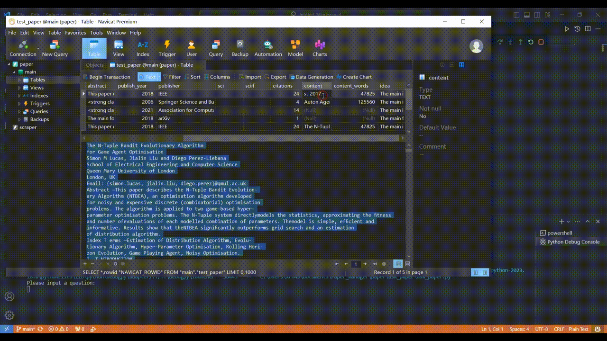

# Introduction
**Perhaps this is a more straightforward alternative to Zotero and CiteSpace.**  
**All the features are streamlined and easy to grasp.**

## main.py

## ask_paper.py

# What's the features?
- Download: Download paper meta data(doi,abstarct,publish_year,if factor,citations) by titles.
- Parse: Add any columns by AI (openai,cluade) parsing.
- Analysis: Use community detection and centrality to analysis keywords.These algorithms are similar as the citepsace!
- Detail asking: If you have Claude api,you could ask any paper.
- Export: Export data to Excel.(Use navicat)

# What's difference between this and Zotero?
- You could auto download paper any data by titles. Zotero need doi.
- You could add any columns by AI (openai,cluade) parsing.  Zotero didn't support.If you use AI to parse papers,you understand what I mean.
- You could find keywords more detail information,such as the center betweenness of keywords,However Zotero didn't support.

# What's difference between this and Citespace?
- The 'keywords analysis' uses AI to extarct keywords. But the way of Citespace operates as a black box.
- Use community detection and centrality to analysis keywords.These algorithms are same as the citepsace.

# How to use
1. You need to have openai api key or claude api key to parse paper.I recommend you to use Claude api key,which is free and support long text parsing.
2. You need to install Navicat to operate database.
3. You need to install chrome to download papers.
3. Clone this repository
4. Execute `pip install -r requirements.txt` to install python packages.
5. Use navicat open 'data/paper.db' and create a table. Then copy paper titles to this table.The title column name must be 'title'.
6. Change .env.template to .env, and set PAPER_TABLE and MODEL,AI API_KEY
7. Execute `main.py` 